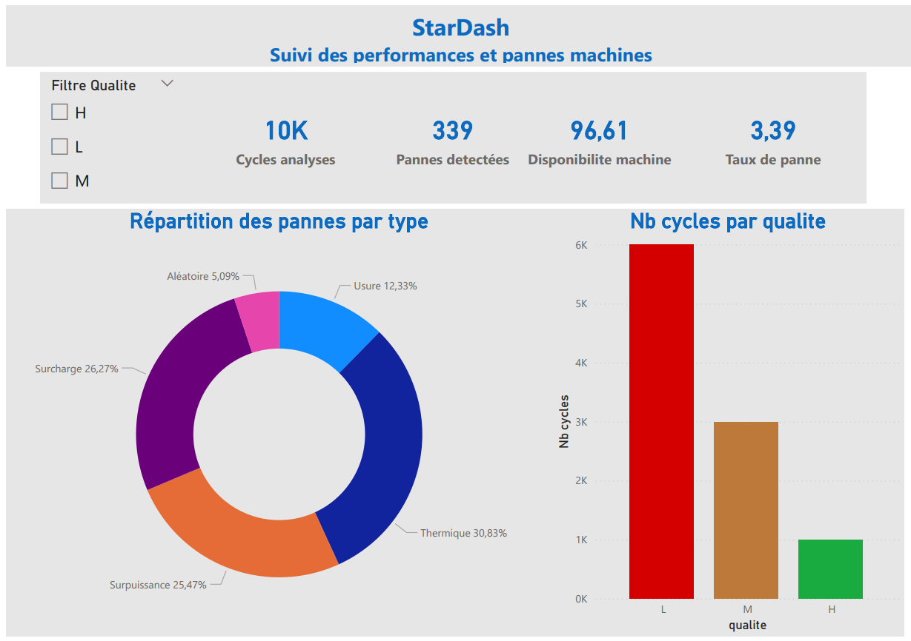
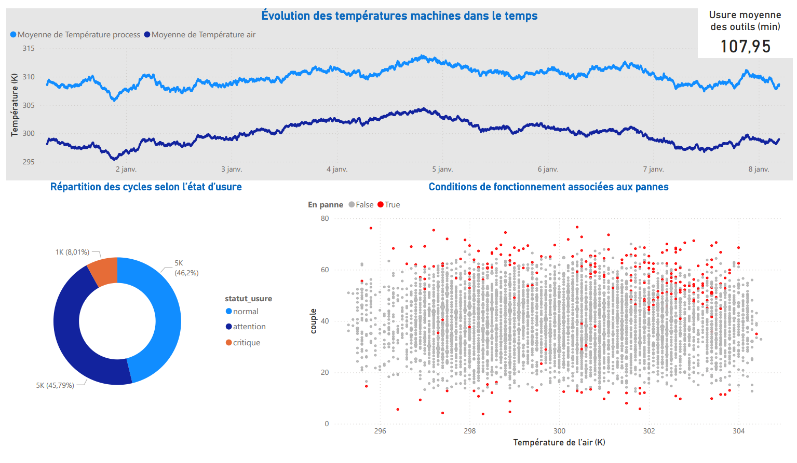

# StarDash — Maintenance Prédictive Industrielle

Pipeline data engineering de bout en bout sur données de capteurs industriels :
ETL · Schéma en étoile PostgreSQL · Dashboard opérationnel Dash/Plotly · Docker · Power BI


---

## Contexte

Ce projet simule une solution d'aide à la décision pour une PME industrielle :
surveiller en temps réel l'état de ses machines, anticiper les pannes et optimiser
la maintenance préventive — directement applicable au contexte de clients industriels
en Guyane et en Amérique du Sud.

---

## Dataset

**AI4I 2020 Predictive Maintenance Dataset** — UCI Machine Learning Repository (ID 601)

| Paramètre | Valeur                                                       |
| --------- | ------------------------------------------------------------ |
| Source    | UCI ML Repository — Stephan Matzka, 2020                     |
| Licence   | CC BY 4.0                                                    |
| Volume    | 10 000 cycles machine, 14 colonnes                           |
| Capteurs  | Temp. air, Temp. process, Vitesse, Couple, Usure outil       |
| Cibles    | Machine failure + 5 types de panne (TWF, HDF, PWF, OSF, RNF) |

> Citation : Matzka, S. (2020). *AI4I 2020 Predictive Maintenance Dataset*. UCI Machine Learning Repository. https://doi.org/10.24432/C5HS5C

---

## Architecture

```
StarDash/
├── data/                       ← Données brutes (CSV)
├── etl/
│   ├── extract.py              ← Téléchargement via ucimlrepo
│   ├── transform.py            ← Nettoyage + colonnes calculées
│   └── load.py                 ← Insertion PostgreSQL (COPY)
├── db/
│   └── init.sql                ← Schéma en étoile
├── dashboard/
│   ├── app.py                  ← Application Dash (entry point)
│   ├── data.py                 ← Couche d'accès PostgreSQL
│   ├── layouts/                ← 4 sections du dashboard
│   └── assets/style.css        ← Thème dark industriel
├── powerbi/
│   └── StarDash_rapport.pbix   ← Rapport Power BI téléchargeable
├── assets/                     ← Screenshots dashboard & rapport
├── Dockerfile
├── docker-compose.yml
└── run_etl.py                  ← Lancement pipeline complet
```

---

## Modélisation analytique — Schéma en étoile

```
dim_machine ──┐
              ├──▶ fait_capteurs
dim_temps   ──┘
```

**`dim_machine`** — identité et segment qualité (L / M / H)
**`dim_temps`** — horodatage, heure, jour de semaine, numéro de semaine
**`fait_capteurs`** — mesures capteurs + indicateurs calculés + flags pannes

### Colonnes calculées

| Colonne             | Formule                                                 | Usage                     |
| ------------------- | ------------------------------------------------------- | ------------------------- |
| `temp_delta`        | process_temp − air_temp                                 | Détection surchauffe      |
| `puissance_estimee` | torque × rpm × (2π / 60)                                | Surveillance surpuissance |
| `statut_usure`      | < 100 → normal · 100–200 → attention · > 200 → critique | Alertes maintenance       |

---

## Dashboard Dash — 4 sections

| Section                    | Contenu                                                         |
| -------------------------- | --------------------------------------------------------------- |
| Vue générale               | KPIs globaux, répartition pannes par type, distribution qualité |
| Surveillance capteurs      | Courbes température, distribution vitesse, heatmap risque       |
| **Maintenance prédictive** | Disponibilité par segment, jauge usure, alertes, top 5 causes   |
| Performance process        | Puissance dans le temps, corrélation thermique, log événements  |

🔗 **[Accéder au dashboard en ligne](https://stardash.data-service.fr/)**

---

## Rapport Power BI

En complément du dashboard temps réel, un rapport Power BI a été développé
sur le même dataset pour l'analyse décisionnelle approfondie.

### Aperçu

<!-- PAGE 1 -->



<!-- PAGE 2 -->



### Télécharger le rapport

📥 [StarDash_rapport.pbix](./powerbi/StarDash_rapport.pbix)

> Nécessite [Power BI Desktop](https://powerbi.microsoft.com/fr-fr/desktop/) (gratuit) pour être ouvert.

---

## Lancement rapide

### Prérequis

- Docker & Docker Compose
- Fichier `.env` (voir `.env.example`)

### Démarrage complet

```bash
# 1. Cloner le dépôt
git clone https://github.com/Xavier973/stardash.git
cd stardash

# 2. Configurer les credentials
cp .env.example .env
# éditer .env avec vos valeurs

# 3. Démarrer PostgreSQL + Dashboard
docker compose up -d postgres dashboard

# 4. Charger les données (run une seule fois)
docker compose run --rm etl

# 5. Accéder au dashboard
# http://localhost:8050
```

### Développement local (sans Docker)

```bash
python -m venv .venv && source .venv/bin/activate
pip install -r requirements.txt

# Charger les données
python run_etl.py

# Lancer le dashboard
python dashboard/app.py
# → http://localhost:8050
```

---

## Stack technique

| Couche       | Technologie                         |
| ------------ | ----------------------------------- |
| Données      | AI4I 2020 (UCI ML Repository)       |
| ETL          | Python 3.10 · Pandas · ucimlrepo    |
| Stockage     | PostgreSQL 15                       |
| Modélisation | Schéma en étoile SQL                |
| Dashboard    | Dash 4 · Plotly 6                   |
| Reporting BI | Power BI Desktop                    |
| Déploiement  | Docker · Docker Compose · VPS Linux |
| Versioning   | Git · GitHub                        |

---

## Auteur

**Xavier Cuniberti** — Data Engineer
Certifié AZ-900 · Cayenne, Guyane française
[LinkedIn](https://www.linkedin.com/in/xavier-cuniberti-528aa84b/) · [GitHub](https://github.com/Xavier973/)
